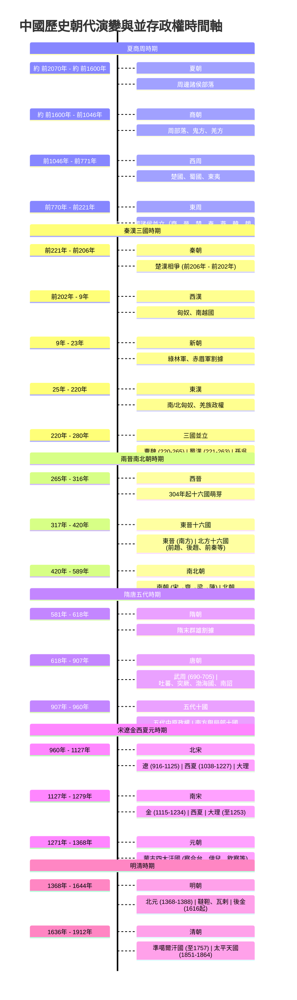

叫 AI 出了個 mermaid 圖, 看看能否轉過來. 

```mermaid
timeline TD
    title 中國歷史朝代演變與並存政權時間軸
    
    section 夏商周時期
        約 前2070年 - 約 前1600年 : 夏朝 : 周邊諸侯部落
        約 前1600年 - 前1046年    : 商朝 : 周部落、鬼方、羌方
        前1046年 - 前771年        : 西周 : 楚國、蜀國、東夷
        前770年 - 前221年         : 東周 : 春秋戰國諸侯並立（齊、晉、楚、秦、燕、韓、趙、魏等）

    section 秦漢三國時期
        前221年 - 前206年         : 秦朝 : 楚漢相爭 (前206年 - 前202年)
        前202年 - 9年             : 西漢 : 匈奴、南越國
        9年 - 23年                : 新朝 : 綠林軍、赤眉軍割據
        25年 - 220年              : 東漢 : 南/北匈奴、羌族政權
        220年 - 280年             : 三國並立 : 曹魏 (220-265) | 蜀漢 (221-263) | 孫吳 (222-280)

    section 兩晉南北朝時期
        265年 - 316年             : 西晉 : 304年起十六國萌芽
        317年 - 420年             : 東晉十六國 : 東晉 (南方) | 北方十六國 (前趙、後趙、前秦等)
        420年 - 589年             : 南北朝 : 南朝 (宋→齊→梁→陳) | 北朝 (北魏→東/西魏→北齊/北周)

    section 隋唐五代時期
        581年 - 618年             : 隋朝 : 隋末群雄割據
        618年 - 907年             : 唐朝 : 武周 (690-705) | 吐蕃、突厥、渤海國、南詔
        907年 - 960年             : 五代十國 : 五代中原政權 | 南方與局部十國 (南唐、吳越、北漢等)

    section 宋遼金西夏元時期
        960年 - 1127年            : 北宋 : 遼 (916-1125) | 西夏 (1038-1227) | 大理
        1127年 - 1279年           : 南宋 : 金 (1115-1234) | 西夏 | 大理 (至1253)
        1271年 - 1368年           : 元朝 : 蒙古四大汗國 (察合台、伊兒、欽察等)

    section 明清時期
        1368年 - 1644年           : 明朝 : 北元 (1368-1388) | 韃靼、瓦剌 | 後金 (1616起)
        1636年 - 1912年           : 清朝 : 準噶爾汗國 (至1757) | 太平天國 (1851-1864)
```
