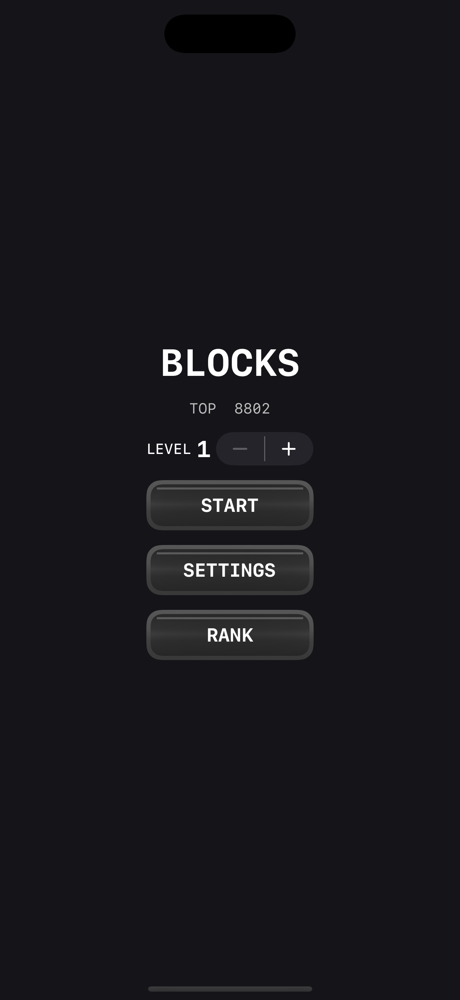
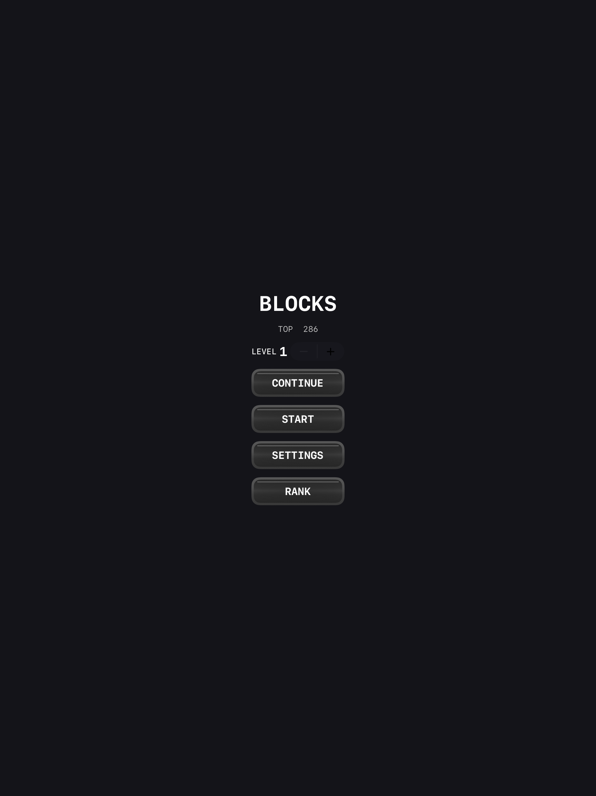
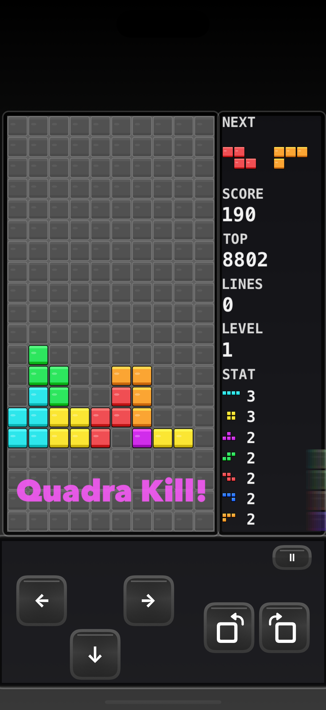
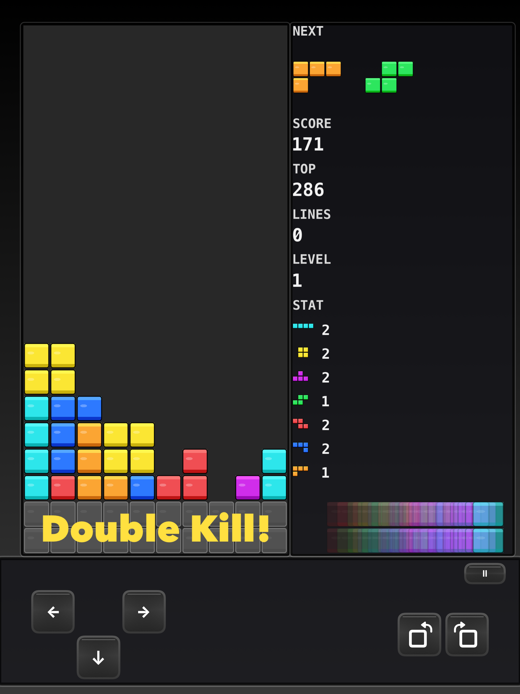
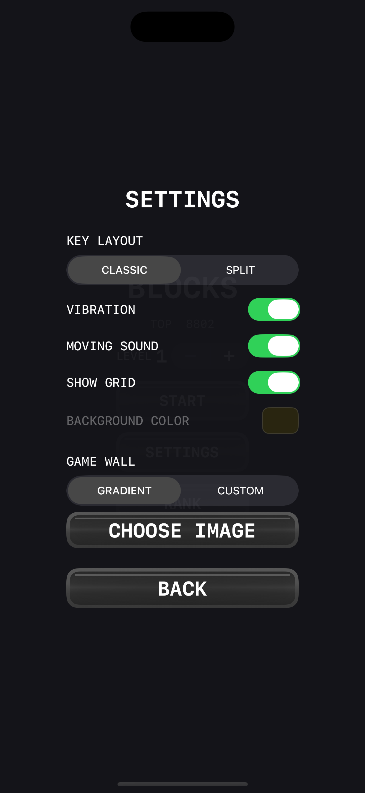
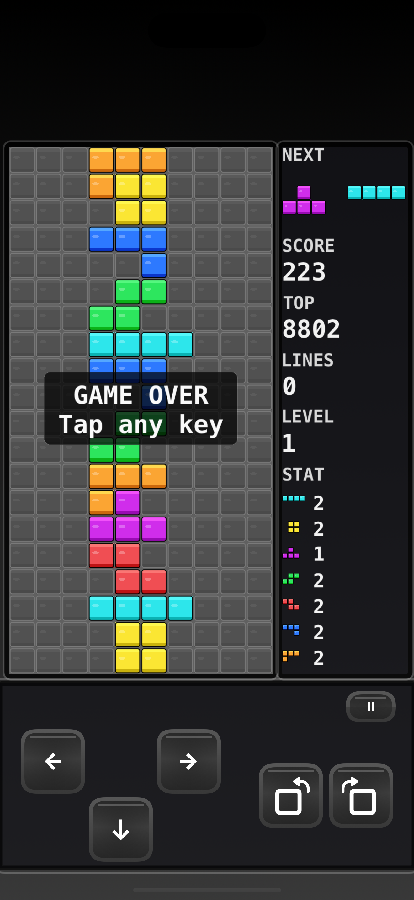

# Blocks — Classic

**Game information**

| | |
|---|---|
| **Display name** | Blocks - Classic |
| **On-screen title** | BLOCKS |
| **Bundle ID** | `com.losiu.blocks` |
| **Platform** | iOS / iPadOS (portrait) |
| **Version** | 1.0 |
| **Genre** | Classic falling-block puzzle |

---

## Overview

*Blocks — Classic* is a traditional tetromino puzzle game: stack the seven piece types on a **10×20** field, clear lines, climb levels, and chase a high score. The UI is split into a playfield, an info column (NEXT / SCORE / STAT), and a large on-screen keypad—designed for phones and iPads.

---

## Highlights

- **Classic ruleset** — 7-bag randomizer, lock delay, wall kicks, NES-style gravity table
- **Guideline-inspired scoring** — line clears, T-Spins, combo, Back-to-Back, soft/hard drop, perfect clear
- **Dual NEXT preview** and per-piece **STAT** counters
- **Two keypad layouts** — Classic and Split
- **Customization** — vibration, move SFX, board grid/color, gradient or custom wallpaper
- **Game Center** — leaderboards (score & lines) and achievements (no floating Access Point icon)
- **Continue** — interrupted games can be resumed from the title screen

---

## Core rules (summary)

| Topic | Detail |
|---|---|
| Field | 10 columns × 20 visible rows (+ 2 hidden buffer rows) |
| Pieces | I, O, T, S, Z, J, L |
| Randomizer | 7-bag |
| Lock delay | 0.5 s while grounded (resets on successful move/rotate) |
| Level | Starts at chosen level **1–10**; increases every 10 lines |
| Hold / ghost | Not used |

Full scoring tables and control details are in the [Player Manual](PLAYER_MANUAL.md).

---

## Screens & flow

1. **Title** — TOP score, starting LEVEL, START / CONTINUE / SETTINGS / RANK  
2. **Play** — board + info column + controls; pause with **Ⅱ**  
3. **Settings** — layout, feedback, visuals, game wall  
4. **Game Over** — banner on the board; tap any control to return  

---

## Audio & feedback

| Event | Feedback |
|---|---|
| Move (← → ↓ / hard drop) | Click SFX (optional **MOVING SOUND**) |
| Rotate | Click SFX |
| Lock | Lock thud + haptic (if vibration on) |
| Line clear | `sfx_clear1`–`4` by line count |
| Perfect clear (empty board) | `sfx_legendary` |
| Stack fall after clear | `sfx_fall` |
| UI confirm / pause / exit | Dedicated short SFX |

---

## Privacy & online features

- **Game Center** is used for leaderboards and achievements when the player is signed in.
- Custom **GAME WALL** images stay on-device (Documents).
- No account other than optional Game Center is required to play offline.

---

## Related docs

- [Player Manual](PLAYER_MANUAL.md) — how to play, controls, settings, scoring
