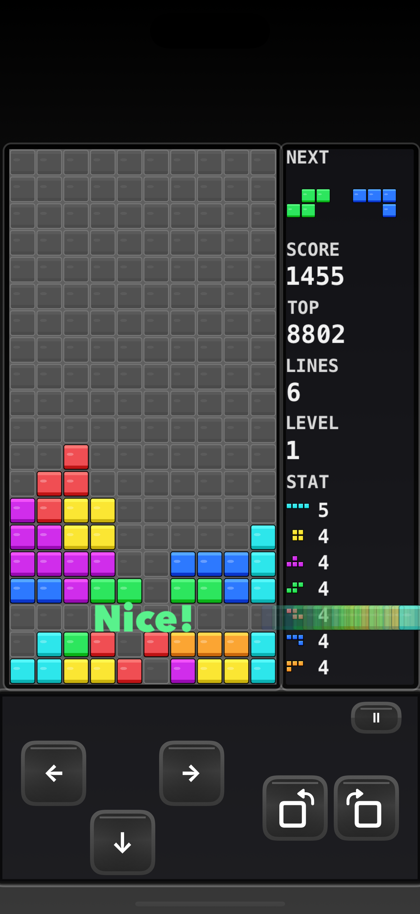
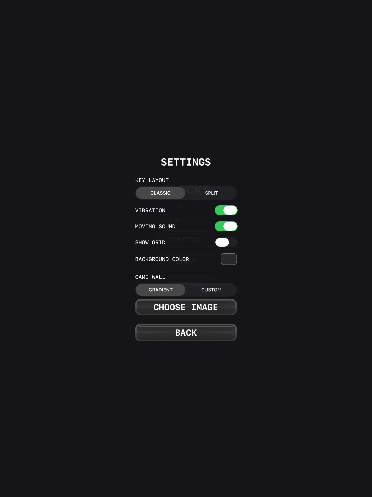

# Blocks — Classic

**Player manual**

This guide explains how to play *Blocks — Classic* on iPhone and iPad.

---

## Getting started

### Title screen

| Control | Action |
|---|---|
| **LEVEL − / +** | Choose starting level **1–10** (speed starts at that level) |
| **START** | New game (clears any saved run) |
| **CONTINUE** | Resume a saved game (shown only when a save exists) |
| **SETTINGS** | Options (see [Settings](#settings)) |
| **RANK** | Open Game Center leaderboards |

Your local best score appears as **TOP**.

---

## Screen layout

During play the screen has three panels:

1. **Block area** — the 10×20 playfield  
2. **Info column** — NEXT, SCORE, TOP, LINES, LEVEL, STAT  
3. **Key panel** — movement, rotate, pause  

### Info column

| Field | Meaning |
|---|---|
| **NEXT** | Next **two** pieces (left → right) |
| **SCORE** | Current score (caps at 999,999) |
| **TOP** | Best score stored on this device |
| **LINES** | Lines cleared this game |
| **LEVEL** | Current level (starts at your chosen level; +1 every 10 lines) |
| **STAT** | How many times each piece type has spawned |

---

## Controls

### Classic layout (default)

- **Left cluster:** ← · → with ↓ underneath (inverted-T)  
- **Right cluster:** rotate counter-clockwise · rotate clockwise  
- **Ⅱ** (top-right of the key panel): pause  

### Split layout

- **Top row:** rotate counter-clockwise · rotate clockwise  
- **Bottom row:** ← · ↓ · →  

Change layout in **SETTINGS → KEY LAYOUT**.

### Move & drop

| Input | Effect |
|---|---|
| **← / →** | Shift one column (hold to auto-repeat) |
| **↓** single tap | Soft drop **one** cell (+1 score per cell) |
| **↓** double-tap | Hard drop to the floor (+2 per cell) and **lock immediately** |
| Rotate buttons | Rotate piece; wall kicks applied when possible |

### Pause menu

From **Ⅱ**: **RESUME**, **SETTINGS**, **RANK**, **EXIT** (confirm to leave; progress is saved so **CONTINUE** can restore it).

---

## How to play

1. Pieces spawn at the top and fall according to the current level’s gravity.  
2. Move and rotate to fit them into the stack.  
3. Fill an entire horizontal row to clear it; multiple rows can clear at once.  
4. Stacks above a clear fall down after a short animation.  
5. If a new piece cannot spawn, the game ends.

### Line-clear callouts

| Lines | Callout |
|---|---|
| 1 | Nice! |
| 2 | Double Kill! |
| 3 | Triple Kill! |
| 4 | Quadra Kill! |

While the clear animation runs, movement input is ignored.

### Game over

When the stack reaches the top, a banner appears on the board:

** GAME OVER**  
**Tap any key**

Tap any control to return to the title screen. The run is submitted to Game Center when signed in.

---

## Scoring

Scores scale with the **current level** (multiplier **N** = level number).

### Line clears

| Clear | Points |
|---|---|
| Single | 100 × N |
| Double | 300 × N |
| Triple | 500 × N |
| Tetris (4) | 800 × N |

### T-Spin

A **T-Spin** is detected when a **T** piece locks after a **rotate**, with at least **3** of the four diagonal corners occupied or out of bounds.

| Result | Points |
|---|---|
| T-Spin Zero (no lines) | 100 × N |
| T-Spin Single | 800 × N |
| T-Spin Double | 1,200 × N |
| T-Spin Triple | 1,600 × N |

T-Spin Zero awards points but **breaks** combo and Back-to-Back.

### Back-to-Back (B2B)

Clearing a **Tetris** or a **T-Spin with lines** after another such “difficult” clear awards **×1.5** on that clear’s base points.

### Combo

- First clear in a streak: no combo bonus  
- Each following clear without a non-clear lock: **+50 × combo count × N**

### Perfect clear (All Clear)

If a clear empties the entire board: **+2,000 × N**, and the special **legendary** sound plays.

### Soft / hard drop

| Action | Points |
|---|---|
| Soft drop | +1 per cell |
| Hard drop | +2 per cell |

---

## Levels & speed

- Starting level is set on the title screen (**1–10**).  
- Level becomes `startLevel + floor(lines / 10)`.  
- Higher levels drop pieces faster (NES A-Type style gravity table).

---

## Settings

Open **SETTINGS** from the title screen or pause menu.

| Setting | Options / default | Notes |
|---|---|---|
| **KEY LAYOUT** | Classic *(default)* / Split | Keypad arrangement |
| **VIBRATION** | On *(default)* / Off | Button & lock haptics |
| **MOVING SOUND** | On *(default)* / Off | Clicks for ← → ↓ and hard drop only |
| **SHOW GRID** | Off *(default)* / On | Indented empty cells; when On, board color picker is disabled |
| **BACKGROUND COLOR** | Dark gray default | Plain board fill when grid is Off |
| **GAME WALL** | Gradient *(default)* / Custom | Full-screen backdrop behind panels |
| **CHOOSE IMAGE** | — | Pick a photo when using Custom (keeps aspect ratio, fills screen) |

**Gradient** wall: black at the top → dark gray at the bottom.

---

## Tips

- Plan with **NEXT** (two pieces ahead).  
- Prefer **Tetris** and **T-Spin** clears for score and Back-to-Back.  
- Use **double-tap ↓** when you are sure of the placement; soft drop is safer for fine control.  
- Raise **LEVEL** on the title screen for a harder start and higher multipliers from the first clear.  
- Turn **MOVING SOUND** off if you only want rotate / lock / clear audio.

---

## See also

- [Game Info](GAME_INFO.md) — product overview and feature list
