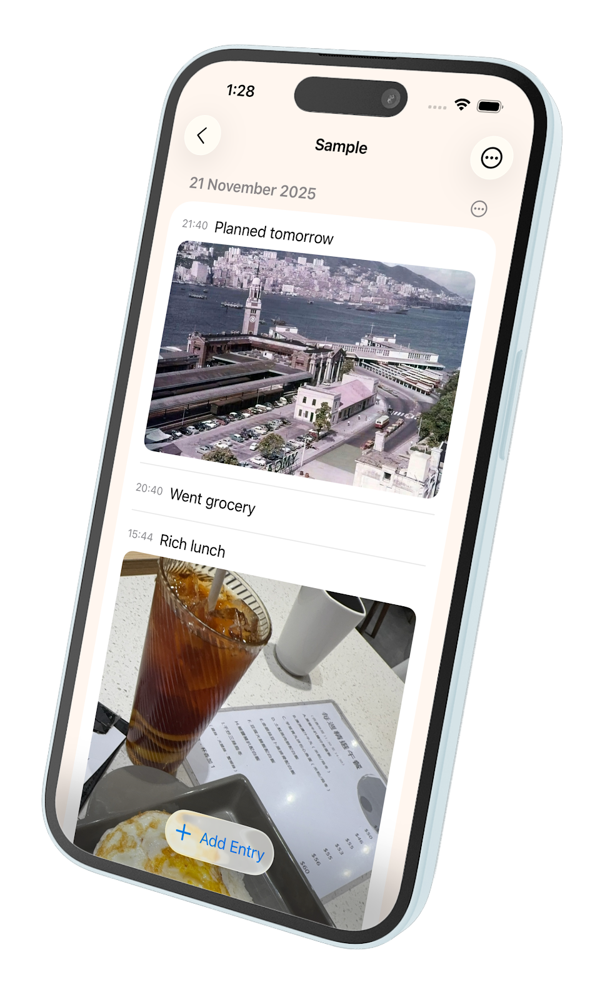

See the [Day Log app manual](daylog-manual.md) for how to use the app.

### Welcome to use Day Log!

This is a handy tool:

Quickly write down what you are doing at this moment. Keep track date/time.

- Multiple books for personal, work related, or others!
- Export whole day events for your diary/sharing.
- Export entire book's content for backup.
- Embed pictures / video
- Quick save phrases for reuse
- Estimate how long an event lasts for.
- Identify each book by color.
- Book's background colors
- Supports dark theme
- Random entries for fun and demo!
- Tell me what features you want!

快速記錄您當下正在做的事情。記錄日期/時間。

- 多本日誌，可用於個人、工作或其他用途！
- 匯出全天事件，供您的日記或分享用。
- 匯出整本內容作為備份。
- 嵌入圖片 / 影片
- 快速保存短語以便重用
- 估算事件持續時間。
- 以顏色區分每本日誌。
- 日誌背景顏色
- 支援深色主題
- 隨機新增項目，趣味展示用！
- 告訴我們您希望新增的功能！
