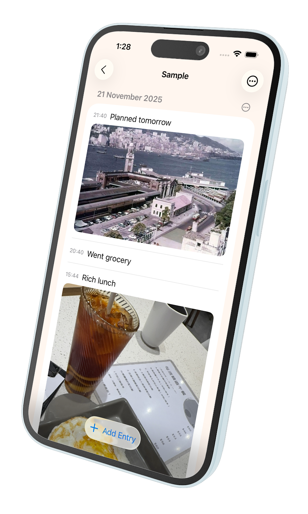

# Day Log

Quickly log what you’re doing — keep a timeline of your day.

See the [Day Log app manual](daylog-manual.md) for how to use the app.

Day Log is a simple journal for moments as they happen. Capture what you’re doing now, keep date and time with each entry, and organise life across multiple books — personal, work, or anything else.

### Capture the moment

- Quickly write down what you are doing right now
- Keep track of date and time with every entry
- Estimate how long an event lasts
- Embed pictures and video

### Organise with books

- Multiple books for personal, work, or other uses
- Identify each book by colour
- Customise book background colours
- Supports Dark Mode

### Reuse and export

- Save quick phrases for reuse
- Export a whole day’s events for diary or sharing
- Export an entire book’s content for backup
- Add random entries for fun and demo

---

## Day Log

快速記錄當下——為每一天留下時間線。

詳見 [Day Log 使用說明](daylog-manual.md)。

Day Log 是一款輕巧的當下記錄工具。隨時記下正在做的事，每筆都帶日期與時間，並用多本日誌分開整理個人、工作或其他用途。

### 捕捉當下

- 快速寫下此刻正在做的事
- 每筆記錄日期與時間
- 估算事件持續時間
- 嵌入圖片與影片

### 用日誌本整理

- 多本日誌，可用於個人、工作或其他用途
- 以顏色區分每本日誌
- 自訂日誌背景顏色
- 支援深色模式

### 重用與匯出

- 快速保存短語以便重用
- 匯出全天事件，供日記或分享用
- 匯出整本內容作為備份
- 隨機新增項目，趣味展示用

Need help? See [App Support](support.md) and [Privacy](privacy.md).
